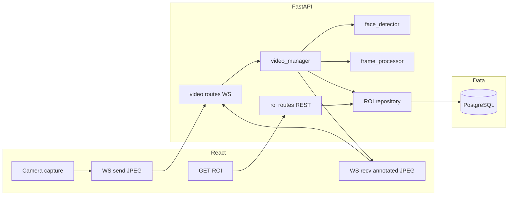

# DevMesh “Mega AI” submission plan (canonical)

## Core requirements (constraints that matter)

- **No OpenCV** — Face detection + axis-aligned minimal bounding box drawing **without** `cv2` / `opencv-python`. Treat as **no OpenCV dependency anywhere**; inspect the lockfile for transitive pulls.
- **Three endpoints** — (1) **receive** video/frames, (2) **serve** processed feed with ROI drawn, (3) **serve** ROI data. Canonical interpretation for this submission: **WebSocket** for (1) and (2), **REST** for (3). JPEG frames over WebSocket as binary messages (pragmatic; no RTSP/HLS).
- **PostgreSQL** — Persist ROI-related data; use **Alembic** migrations.
- **Containerized** — `docker compose up` runs **frontend + backend + postgres**.
- **React** — Display live feed and ROI information.
- **Architecture diagram** — `**architecture.png`** at repo root (or `docs/` if you prefer; be consistent with README).
- **AI attestation** — Document tool usage for final report signals.

---

## Analysis of evaluation metrics (equal weight — none optional)


| Rubric                             | What “aces” looks like                                                                                                                                                             |
| ---------------------------------- | ---------------------------------------------------------------------------------------------------------------------------------------------------------------------------------- |
| **Setup & Documentation**          | `docker compose up --build` on a clean clone; README with ports, env, troubleshooting; **5-minute** stranger path. Pass/fail in practice if this breaks.                           |
| **Version Control Habits**         | **~15–25** small commits, **conventional** messages (`feat:`, `fix:`, `chore:`); story from scaffold → features → hardening. Feature branches optional.                            |
| **Pragmatism vs Over-engineering** | **One** backend, **one** DB, **one** frontend. **No** Kafka, Redis, microservices, message buses. Senior signal = knowing what **not** to add.                                     |
| **API Design & Contracts**         | Correct HTTP methods, status codes, content types; **OpenAPI/Swagger** via FastAPI; REST for ROI; WebSocket semantics documented.                                                  |
| **Architecture & Separation**      | Routes, services, models, schemas, db **separated** — not a single god file.                                                                                                       |
| **Database & Schema**              | Normalized PostgreSQL schema, migrations, sensible ROI + frame metadata, indexes for real queries.                                                                                 |
| **Error Handling & Edge cases**    | Validation, **no-face** behavior, corrupt/oversized frames, **WebSocket disconnects**, DB failures, clear HTTP errors.                                                             |
| **Security fundamentals**          | CORS allowlist, input validation, **max WS message / image size**, light **per-session rate cap**, parameterized queries (SQLAlchemy), **no secrets in git**, `.env.example` only. |
| **Testing**                        | **pytest** — API, face pipeline (stubbed), DB where it matters; full coverage not required.                                                                                        |


---

## Recommended repository layout

```text
├── backend/
│   ├── app/
│   │   ├── main.py              # FastAPI app, CORS, lifespan
│   │   ├── api/
│   │   │   └── routes/
│   │   │       ├── video.py     # WebSocket: receive feed + serve processed feed
│   │   │       └── roi.py       # REST: ROI data
│   │   ├── services/
│   │   │   ├── face_detector.py # MediaPipe (or pluggable interface)
│   │   │   ├── frame_processor.py # Pillow decode/draw/re-encode
│   │   │   └── video_manager.py # Sessions, subscribers, broadcast
│   │   ├── models/
│   │   │   ├── session.py       # SQLAlchemy session model
│   │   │   └── roi.py           # SQLAlchemy ROI model
│   │   ├── schemas/
│   │   │   └── roi.py           # Pydantic schemas
│   │   ├── db/
│   │   │   ├── session.py       # Engine, session factory
│   │   │   └── migrations/      # Alembic
│   │   └── config.py            # pydantic-settings from env
│   ├── tests/
│   ├── Dockerfile
│   └── requirements.txt         # or pyproject.toml + lockfile
├── frontend/
│   ├── src/
│   ├── Dockerfile
│   └── package.json
├── docker-compose.yml
├── architecture.png
├── .env.example
├── AI_ATTESTATION.md
└── README.md
```

**Why FastAPI** — OpenAPI out of the box, native async + WebSockets, Pydantic validation; better “API contracts” score per line than Flask for this brief.

---

## Architecture (data flow)




---

## Key technical decisions


| Area             | Choice                                            | Notes                                                                                                                     |
| ---------------- | ------------------------------------------------- | ------------------------------------------------------------------------------------------------------------------------- |
| Detection        | **MediaPipe** Face Detection                      | Bounding boxes without OpenCV; check **wheel support** (e.g. ARM vs x86) in Docker base image.                            |
| Drawing          | **Pillow**                                        | `Image.open` / `fromarray` → `ImageDraw.rectangle` → JPEG bytes.                                                          |
| Frame transport  | **JPEG over WebSocket**                           | Binary messages; optional small JSON ack with `frame_number`, `detected`, bbox for debugging.                             |
| Processed egress | **Second WebSocket path or multiplexed protocol** | e.g. `/ws/streams/{id}/in` and `/ws/streams/{id}/out`, or documented message types on one socket — pick one and document. |
| ROI API          | **GET** `/api/v1/sessions/{id}/roi`               | Latest by default; query params `limit`, `before_frame`, etc.                                                             |


**Frontend note** — Receiving JPEG blobs: `Blob` → `URL.createObjectURL` → `` or canvas; **revoke** old URLs to avoid memory growth during long demos.

---

## Database schema (PostgreSQL)

Use a `**stream_sessions`** table for lifecycle and FK integrity, plus `**roi_detections`** for per-frame records.

`**roi_detections` (illustrative — enforce in Alembic):**

```sql
CREATE TABLE stream_sessions (
    id UUID PRIMARY KEY,
    created_at TIMESTAMPTZ NOT NULL DEFAULT NOW(),
    status VARCHAR(32) NOT NULL DEFAULT 'active'
);

CREATE TABLE roi_detections (
    id SERIAL PRIMARY KEY,
    session_id UUID NOT NULL REFERENCES stream_sessions(id) ON DELETE CASCADE,
    frame_number INTEGER NOT NULL,
    x_min INTEGER NOT NULL,
    y_min INTEGER NOT NULL,
    x_max INTEGER NOT NULL,
    y_max INTEGER NOT NULL,
    confidence FLOAT,
    frame_width INTEGER,
    frame_height INTEGER,
    created_at TIMESTAMPTZ NOT NULL DEFAULT NOW(),
    UNIQUE (session_id, frame_number),
    CHECK (x_max > x_min AND y_max > y_min)
);

CREATE INDEX idx_roi_session_frame ON roi_detections (session_id, frame_number DESC);
```

**No-face policy (choose one, document in README)** — e.g. skip insert and return `detected: false` in WS ack; or insert row with nullable bbox columns; or `face_present` boolean. Evaluators look for **explicit** behavior.

---

## Video / face pipeline

1. Receive JPEG bytes on ingest WebSocket; decode with **Pillow** or raw bytes → RGB array if MediaPipe needs ndarray.
2. **face_detector** returns axis-aligned box (clamp to frame).
3. **frame_processor** draws rectangle (Pillow); re-encode JPEG.
4. Persist **roi_detections** + broadcast annotated JPEG to subscriber WebSocket(s).
5. Optional: **FPS cap** server-side (document under limitations / non-goals).

---

## API contracts (OpenAPI + README examples)

- **Session bootstrap** — Small **POST**  `/api/v1/sessions` (or equivalent) returning `session_id` is pragmatic and keeps WS URLs clean; it is **not** counted as one of the three “feature” endpoints if README defines the three as ingest / processed stream / ROI — or list four routes honestly; prefer clarity over pedantry.
- **WS ingest** — Binary JPEG in; JSON metadata out per frame (seq, bbox, detected).
- **WS processed** — Binary JPEG out (annotated); document client subscription model.
- **GET ROI** — `200` + JSON; `404` unknown session; validation errors `422`.

---

## Docker

- **docker-compose.yml** — `postgres`, `backend`, `frontend`.
- **Healthchecks** — Postgres; backend `/healthz` + `/readyz` (DB ping).
- `**.env.example`** — `DATABASE_URL`, CORS origins, max message size, FPS cap, etc.
- **Non-root** images where practical; pin base images and Python deps.

---

## Testing strategy

- **API/REST** — `httpx.AsyncClient` / `TestClient` for sessions + ROI GET.
- **WebSocket** — Smoke: connect, send small valid JPEG fixture, assert JSON ack or processed path (may use stub detector).
- **Domain** — Bbox clamping, coordinate scaling, “box inside image”.
- **DB** — Insert + query with test database or transactions rolled back.
- **CV** — **Stub** `face_detector` in unit tests so CI does not depend on model download/GPU.

---

## Git history (target ~15–25 commits)

Illustrative sequence:

1. chore: initial project structure and gitignore
2. feat: FastAPI app with health and CORS
3. feat: database session and Alembic baseline
4. feat: stream_sessions and roi_detections migration
5. feat: video_manager session lifecycle
6. feat: WebSocket JPEG ingest
7. feat: MediaPipe face detection service
8. feat: Pillow frame processor with ROI draw
9. feat: persist ROI and REST endpoint
10. feat: WebSocket processed frame broadcast
11. feat: React webcam client and display
12. fix: handle no-face and corrupt frames
13. test: API and ROI repository tests
14. chore: Docker Compose and env example
15. docs: README and architecture diagram
16. docs: AI attestation

---

## 4-day execution schedule


| Day   | Focus                                                                                                      | Hours (guide) | Commits (guide) |
| ----- | ---------------------------------------------------------------------------------------------------------- | ------------- | --------------- |
| **1** | Foundation: structure, FastAPI, Postgres + SQLAlchemy + Alembic, Docker Compose backend + postgres, health | ~6            | ~5–6            |
| **2** | Core: MediaPipe + Pillow, WS ingest, WS processed egress, REST ROI, DB writes                              | ~8            | ~6–8            |
| **3** | Frontend + Compose frontend service, error handling, WS client (revoke URLs), ROI panel                    | ~6            | ~5–6            |
| **4** | Tests, architecture.png, README (5-min path), AI_ATTESTATION.md, cold clone `docker compose` verification  | ~4–6          | ~4–6            |


**Buffer** — Move **first tests** into late Day 3 if Day 4 risks crunch; MediaPipe-in-Docker and webcam permissions are common slip risks.

---

## Critical tips (submission quality)

- **Cold run** — Clone to a fresh directory and run `docker compose up --build` before submit; fix anything >5 minutes.
- **Git from day one** — No single “dump” commit; conventional messages throughout.
- **Do not over-engineer** — No queues, no extra data stores, no microservices.
- **AI_ATTESTATION.md** — Honest and specific (e.g. architecture planning, Docker debugging, test scaffolding).
- **Optional note** — If a grader prefers HTTP for “serve video,” **MJPEG GET** can be mentioned as an alternative; this canonical plan standardizes on **dual WebSocket** for video to match your chosen design and the “WebSockets” stack emphasis.

---

## Over-engineering traps to avoid

- HLS/DASH, RTSP gateways, Kafka, Redis caches, Kubernetes, full OAuth IdP.
- Storing full raw video in Postgres.

---

## Submission checklist

- `docker compose up --build` from clean clone (macOS/Linux noted in README)
- README: prerequisites, ports, demo steps, no-face behavior, limitations
- OpenAPI usable; HTTP semantics correct for ROI routes
- No `opencv-python` (and no accidental transitive OpenCV)
- `architecture.png` present and referenced in README
- `AI_ATTESTATION.md` present
- `pytest` (or documented test command) passes locally / CI
- ~15–25 meaningful commits on main/feature branch as submitted

